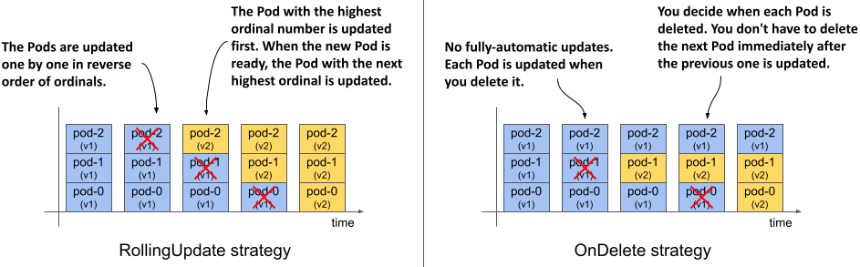

## 15.3 Updating a StatefulSet

In addition to declarative scaling, StatefulSets also provide declarative updates, similar to Deployments. When you update the Pod template in a StatefulSet, the controller recreates the Pods with the updated template.

You may recall that the Deployment controller can perform the update in two ways, depending on the strategy specified in the Deployment object. You can also specify the update strategy in the `updateStrategy` field in the `spec` section of the StatefulSet manifest, but the available strategies are different from those in a Deployment, as you can see in the following table.

#### Table 15.2 The supported StatefulSet update strategies
| Value | Description |
| -- | -- |
| RollingUpdate | In this update strategy, the Pods are replaced one by one. The Pod with the highest ordinal number is deleted first and replaced with a Pod created with the new template. When this new Pod is ready, the Pod with the next highest ordinal number is replaced. The process continues until all Pods have been replaced. This is the default strategy.|
| OnDelete | The StatefulSet controller waits for each Pod to be manually deleted. When you delete the Pod, the controller replaces it with a Pod created with the new template. With this strategy, you can replace Pods in any order and at any rate.|

The following figure shows how the Pods are updated over time for each update strategy.

#### Figure 15.8 How the Pods are updated over time with different update strategies


The `RollingUpdate` strategy, which you can find in both Deployments and StatefulSets, is similar between the two objects, but differs in the parameters you can set. The `OnDelete` strategy lets you replace Pods at your own pace and in any order. It’s different from the `Recreate` strategy found in Deployments, which automatically deletes and replaces all Pods at once.

### 15.3.1 Using the RollingUpdate strategy

The RollingUpdate strategy in a StatefulSet behaves similarly to the RollingUpdate strategy in Deployments, but only one Pod is replaced at a time. You may recall that you can configure the Deployment to replace multiple Pods at once using the `maxSurge` and `maxUnavailable` parameters. The rolling update strategy in StatefulSets has no such parameters.

You may also recall that you can slow down the rollout in a Deployment by setting the `minReadySeconds` field, which causes the controller to wait a certain amount of time after the new Pods are ready before replacing the other Pods. You’ve already learned that StatefulSets also provide this field and that it affects the scaling of StatefulSets in addition to the updates.

Let’s update the `quiz-api` container in the `quiz` StatefulSet to version `0.2`. Since `RollingUpdate` is the default update strategy type, you can omit the `updateStrategy` field in the manifest. To trigger the update, use `kubectl edit` to change the value of the `ver` label and the image tag in the `quiz-api` container to `0.2`. You can also apply the manifest file `sts.quiz.0.2.yaml` with `kubectl apply` instead.

You can track the rollout with the `kubectl rollout status` command as in the previous chapter. The full command and its output are as follows:

```shell
$ kubectl rollout status sts quiz
Waiting for partitioned roll out to finish: 0 out of 3 new pods have been updated...
Waiting for 1 pods to be ready...
Waiting for partitioned roll out to finish: 1 out of 3 new pods have been updated...
Waiting for 1 pods to be ready...
...
```

Because the Pods are replaced one at a time and the controller waits until each replica is ready before moving on to the next, the `quiz` Service remains accessible throughout the process. If you list the Pods as they’re updated, you’ll see that the Pod with the highest ordinal number, `quiz-2`, is updated first, followed by `quiz-1`, as shown here:

```shell
$ kubectl get pods -l app=quiz -L controller-revision-hash,ver
NAME     READY   STATUS        RESTARTS   AGE   CONTROLLER-REVISION-HASH   VER
quiz-0   2/2     Running       0          50m   quiz-6c48bdd8df            0.1
quiz-1   2/2     Terminating   0          10m   quiz-6c48bdd8df            0.1
quiz-2   2/2     Running       0          20s   quiz-6945968d9             0.2
```

The update process is complete when the Pod with the lowest ordinal number, `quiz-0`, is updated. At this point, the `kubectl rollout status` command reports the following status:

```shell
$ kubectl rollout status sts quiz
partitioned roll out complete: 3 new pods have been updated...
```

#### Updates with Pods that aren’t ready

If the StatefulSet is configured with the `RollingUpdate` strategy and you trigger the update when not all Pods are ready, the rollout is held back. The `kubectl rollout status` indicates that the controller is waiting for one or more Pods to be ready.

If a new Pod fails to become ready during the update, the update is also paused, just like a Deployment update. The rollout will resume when the Pod is ready again. So, if you deploy a faulty version whose readiness probe never succeeds, the update will be blocked after the first Pod is replaced. If the number of replicas in the StatefulSet is sufficient, the service provided by the Pods in the StatefulSet is unaffected.

#### Displaying the revision history

You may recall that Deployments keep a history of recent revisions. Each revision is represented by the ReplicaSet that the Deployment controller created when that revision was active. StatefulSets also keep a revision history. You can use the `kubectl rollout history` command to display it as follows.

```shell
$ kubectl rollout history sts quiz
statefulset.apps/quiz
REVISION  CHANGE-CAUSE
1         <none>
2         <none>
```

You may wonder where this history is stored, because unlike Deployments, a StatefulSet manages Pods directly. And if you look at the object manifest of the `quiz` StatefulSet, you’ll notice that it only contains the current Pod template and no previous revisions. So where is the revision history of the StatefulSet stored?

The revision history of StatefulSets and DaemonSets, which you’ll learn about in the next chapter, is stored in ControllerRevision objects. A ControllerRevision is a generic object that represents an immutable snapshot of the state of an object at a particular point in time. You can list ControllerRevision objects as follows:

```shell
$ kubectl get controllerrevisions
NAME              CONTROLLER              REVISION   AGE
quiz-6945968d9    statefulset.apps/quiz   2          1m
quiz-6c48bdd8df   statefulset.apps/quiz   1          50m
```

Since these objects are used internally, you don’t need to know anything more about them. However, if you want to learn more, you can use the `kubectl explain` command.

#### Rolling back to a previous revision

If you’re updating the StatefulSet and the rollout hangs, or if the rollout was successful, but you want to revert to the previous revision, you can use the `kubectl rollout undo` command, as described in the previous chapter. You’ll update the `quiz` StatefulSet again in the next section, so please reset it to the previous version as follows:

```shell
$ kubectl rollout undo sts quiz
statefulset.apps/quiz rolled back
```

You can also use the `--to-revision` option to return to a specific revision. As with Deployments, Pods are rolled back using the update strategy configured in the StatefulSet. If the strategy is `RollingUpdate`, the Pods are reverted one at a time.

### 15.3.2 RollingUpdate with partition

StatefulSets don’t have a pause field that you can use to prevent a Deployment rollout from being triggered, or to `pause` it halfway. If you try to pause the StatefulSet with the `kubectl rollout pause` command, you receive the following error message:

```shell
$ kubectl rollout pause sts quiz
error: statefulsets.apps "quiz" pausing is not supported
```

In a StatefulSet you can achieve the same result and more with the `partition` parameter of the `RollingUpdate` strategy. The value of this field specifies the ordinal number at which the StatefulSet should be partitioned. As shown in the following figure, pods with an ordinal number lower than the `partition` value aren’t updated.

#### Figure 15.9 Partitioning a rolling update


If you set the `partition` value appropriately, you can implement a Canary deployment, control the rollout manually, or stage an update instead of triggering it immediately.

#### Staging an update

To stage a StatefulSet update without actually triggering it, set the partition value to the number of replicas or higher, as in the manifest file `sts.quiz.0.2.partition.yaml` shown in the following listing.

```shell
Listing 15.7 Staging a StatefulSet update with the partition field
apiVersion: apps/v1
kind: StatefulSet
metadata:
  name: quiz
spec:
  updateStrategy:
    type: RollingUpdate
    rollingUpdate:
      partition: 3
  replicas: 3
  ...
  ```

  Apply this manifest file and confirm that the rollout doesn’t start even though the Pod template has been updated. If you set the `partition` value this way, you can make several changes to the StatefulSet without triggering the rollout. Now let’s look at how you can trigger the update of a single Pod.

#### Deploying a canary

To deploy a canary, set the `partition` value to the number of replicas minus one. Since the `quiz` StatefulSet has three replicas, you set the `partition` to `2`. You can do this with the `kubectl patch` command as follows:

```shell
$ kubectl patch sts quiz -p '{"spec": {"updateStrategy": {"rollingUpdate": {"partition": 2 }}}}'
statefulset.apps/quiz patched
```

If you now look at the list of `quiz` Pods, you’ll see that only the Pod `quiz-2` has been updated to version `0.2`

```shell
$ kubectl get pods -l app=quiz -L controller-revision-hash,ver
NAME     READY   STATUS    RESTARTS   AGE   CONTROLLER-REVISION-HASH   VER
quiz-0   2/2     Running   0          8m    quiz-6c48bdd8df            0.1
quiz-1   2/2     Running   0          8m    quiz-6c48bdd8df            0.1
quiz-2   2/2     Running   0          20s   quiz-6945968d9             0.2
```

The Pod `quiz-2` is the canary that you use to check if the new version behaves as expected before rolling out the changes to the remaining Pods.

At this point I’d like to draw your attention to the `status` section of the StatefulSet object. It contains information about the total number of replicas, the number of replicas that are ready and available, the number of current and updated replicas, and their revision hashes. To display the status, run the following command:

```shell
$ kubectl get sts quiz -o yaml
...
status:
  availableReplicas: 3
  collisionCount: 0
  currentReplicas: 2
  currentRevision: quiz-6c48bdd8df
  observedGeneration: 8
  readyReplicas: 3
  replicas: 3
  updateRevision: quiz-6945968d9
  updatedReplicas: 1
```

As you can see from the `status`, the StatefulSet is now split into two partitions. If a Pod is deleted at this time, the StatefulSet controller will create it with the correct template. For example, if you delete one of the Pods with version 0.1, the replacement Pod will be created with the previous template and will run again with version 0.1. If you delete the Pod that’s already been updated, it’ll be recreated with the new template. Feel free to try this out for yourself. You can’t break anything.

#### Completing a partitioned update

When you’re confident the canary is fine, you can let the StatefulSet update the remaining pods by setting the `partition` value to zero as follows:

```shell
$ kubectl patch sts quiz -p '{"spec": {"updateStrategy": {"rollingUpdate": {"partition": 0 }}}}'
statefulset.apps/quiz patched
```

When the `partition` field is set to zero, the StatefulSet updates all Pods. First, the pod `quiz-1` is updated, followed by `quiz-0`. If you had more Pods, you could also use the `partition` field to update the StatefulSet in phases. In each phase, you decide how many Pods you want to update and set the `partition` value accordingly.

At the time of writing, `partition` is the only parameter of the RollingUpdate strategy. You’ve seen how you can use it to control the rollout. If you want even more control, you can use the `OnDelete` strategy, which I’ll try next. Before you continue, please reset the StatefulSet to the previous revision as follows:

```shell
$ kubectl rollout undo sts quiz
statefulset.apps/quiz rolled back
```

### 15.3.3 OnDelete strategy

If you want to have full control over the rollout process, you can use the `OnDelete` update strategy. To configure the StatefulSet with this strategy, use `kubectl apply` to apply the manifest file `sts.quiz.0.2.onDelete.yaml`. The following listing shows how the update strategy is set.

#### Listing 15.8 Setting the OnDelete update strategy
```shell
apiVersion: apps/v1
kind: StatefulSet
metadata:
  name: quiz
spec:
  updateStrategy:
    type: OnDelete
  ...
```

This manifest updates the `quiz-api` container in the Pod template to use the `:0.2` image tag. However, because it sets the update strategy to `OnDelete`, nothing happens when you apply the manifest.

If you use the `OnDelete` strategy, the rollout is semi-automatic. You manually delete each Pod, and the StatefulSet controller then creates the replacement Pod with the new template. With this strategy, you can decide which Pod to update and when. You don’t necessarily have to delete the Pod with the highest ordinal number first. Try deleting the Pod `quiz-0`. When its containers exit, a new `quiz-0` Pod with version `0.2` appears:

```shell
$ kubectl get pods -l app=quiz -L controller-revision-hash,ver
NAME     READY   STATUS    RESTARTS   AGE   CONTROLLER-REVISION-HASH   VER
quiz-0   2/2     Running   0          53s   quiz-6945968d9             0.2
quiz-1   2/2     Running   0          11m   quiz-6c48bdd8df            0.1
quiz-2   2/2     Running   0          12m   quiz-6c48bdd8df            0.1
```

To complete the rollout, you need to delete the remaining Pods. You can do this in the order that the workloads require, or in the order that you want.

#### Rolling back with the OnDelete strategy

Since the update strategy also applies when you use the `kubectl rollout undo` command, the rollback process is also semi-automatic. You must delete each Pod yourself if you want to roll it back to the previous revision.

#### Updates with Pods that aren’t ready

Since you control the rollout and the controller replaces any Pod you delete, the Pod’s readiness status is irrelevant. If you delete a Pod that’s not ready, the controller updates it.

If you delete a Pod and the new Pod isn’t ready, but you still delete the next Pod, the controller will update that second Pod as well. It’s your responsibility to consider Pod readiness.