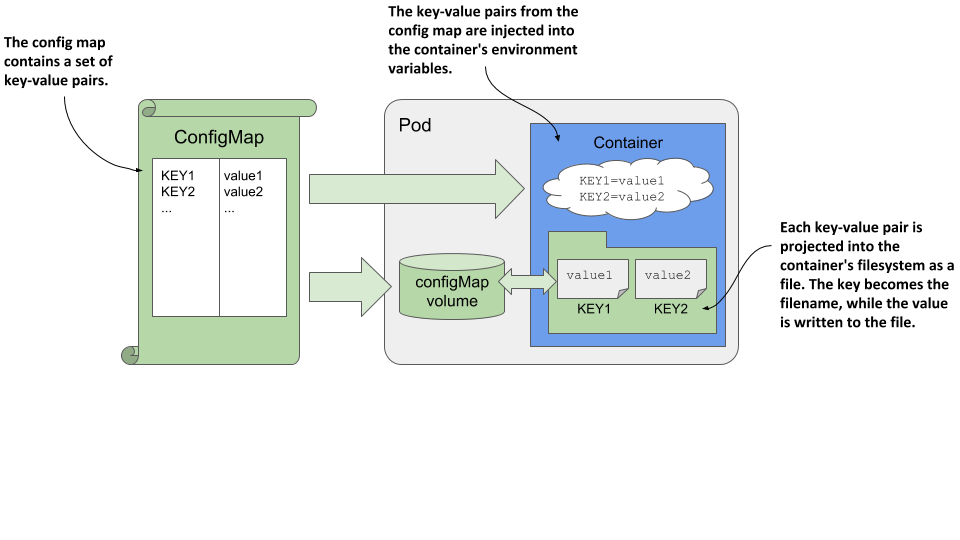
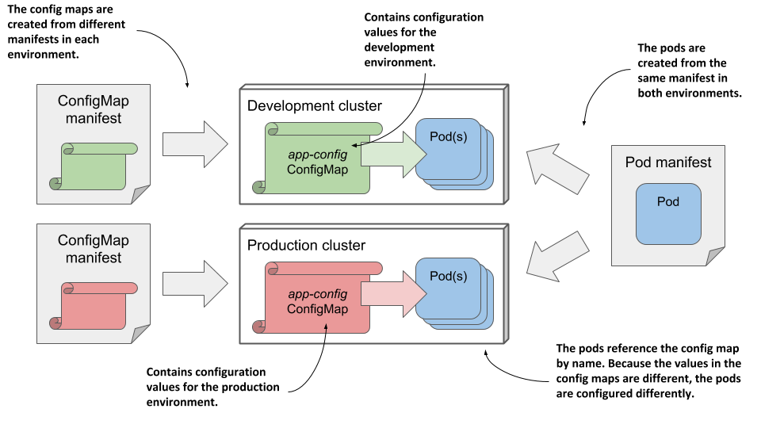
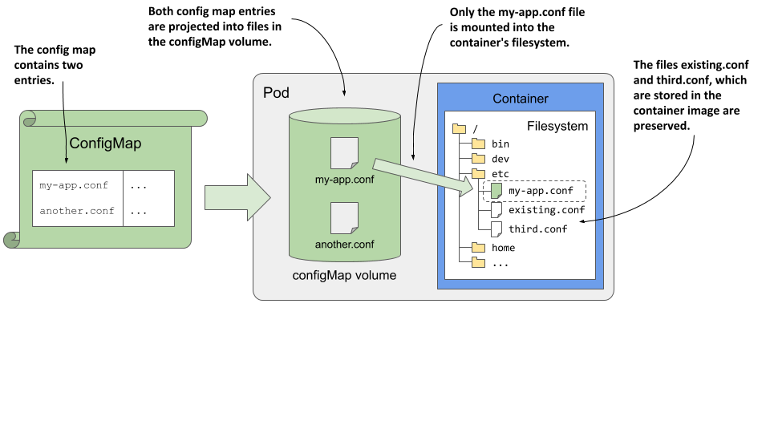

# 9.2 Using a config map to decouple configuration from the pod
In the previous section, you learned how to hardcode configuration directly into your pod manifests. While this is much better than hard-coding in the container image, it’s still not ideal because it means you might need a separate version of the pod manifest for each environment you deploy the pod to, such as your development, staging, or production cluster.

To reuse the same pod definition in multiple environments, it’s better to decouple the configuration from the pod manifest. One way to do this is to move the configuration into a ConfigMap object, which you then reference in the pod manifest. This is what you’ll do next.

## 9.2.1 Introducing ConfigMaps
A ConfigMap is a Kubernetes API object that simply contains a list of key/value pairs. The values can range from short strings to large blocks of structured text that you typically find in an application configuration file. Pods can reference one or more of these key/value entries in the config map. A pod can refer to multiple config maps, and multiple pods can use the same config map.

To keep applications Kubernetes-agnostic, they typically don’t read the ConfigMap object via the Kubernetes REST API. Instead, the key/value pairs in the config map are passed to containers as environment variables or mounted as files in the container’s filesystem via a configMap volume, as shown in the following figure.

Figure 9.3 Pods use config maps through environment variables and configMap volumes.


In the previous section you learned how to reference environment variables in command-line arguments. You can use this technique to pass a config map entry that you’ve exposed as an environment variable into a command-line argument.

Regardless of how an application consumes config maps, storing the configuration in a separate object instead of the pod allows you to keep the configuration separate for different environments by simply keeping separate config map manifests and applying each to the environment for which it is intended. Because pods reference the config map by name, you can deploy the same pod manifest across all your environments and still have a different configuration for each environment by using the same config map name, as shown in the following figure.

Figure 9.4 Deploying the same pod manifest and different config map manifests in different environments



## 9.2.2 Creating a ConfigMap object
Let’s create a config map and use it in a pod. The following is a simple example where the config map contains a single entry used to initialize the environment variable INITIAL_STATUS_MESSAGE for the kiada pod.

#### Creating a config map with the kubectl create configmap command
As with pods, you can create the ConfigMap object from a YAML manifest, but a faster way is to use the kubectl create configmap command as follows:

```
$ kubectl create configmap kiada-config --from-literal status-message="This status message is set in the kiada-config config map"
configmap "kiada-config" created
```


NOTE

Keys in a config map may only consist of alphanumeric characters, dashes, underscores, or dots. Other characters are not allowed.


Running this command creates a config map called kiada-config with a single entry. The key and value are specified with the --from-literal argument.

In addition to --from-literal, the kubectl create configmap command also supports sourcing the key/value pairs from files. The following table explains the available methods.

Table 9.2 Options for creating config map entries using kubectl create configmap

| Option | Description |
|---|---|
| --from-literal | Inserts a key and a literal value into the config map. Example: --from-literal mykey=myvalue. |
| --from-file | Inserts the contents of a file into the config map. The behavior depends on the argument that comes after --from-file:

If only the filename is specified (example: --from-file myfile.txt), the base name of the file is used as the key and the entire contents of the file are used as the value.

If key=file is specified (example: --from-file mykey=myfile.txt), the contents of the file are stored under the specified key.

If the filename represents a directory, each file contained in the directory is included as a separate entry. The base name of the file is used as the key, and the contents of the file are used as the value. Subdirectories, symbolic links, devices, pipes, and files whose base name isn’t a valid config map key are ignored. |
| --from-env-file | Inserts each line of the specified file as a separate entry (example: --from-env-file myfile.env). The file must contain lines with the following format: key=value |

Config maps usually contain more than one entry. To create a config map with multiple entries, you can use multiple arguments --from-literal, --from-file, and --from-env-file, or a combination thereof.

#### Creating a config map from a YAML manifest
Alternatively, you can create the config map from a YAML manifest file. The following listing shows the contents of an equivalent manifest file named cm.kiada-config.yaml, which is available in the code repository You can create the config map by applying this file using kubectl apply.

Listing 9.8 A config map manifest file

```
apiVersion: v1
kind: ConfigMap
metadata:
  name: kiada-config
data:
  status-message: This status message is set in the kiada-config config map
```

#### Listing config maps and displaying their contents
Config maps are Kubernetes API objects that live alongside pods, nodes, persistent volumes, and the others you’ve learned about so far. You can use various kubectl commands to perform CRUD operations on them. For example, you can list config maps with:

```
$ kubectl get cm
```


NOTE

The shorthand for configmaps is cm.



You can display the entries in the config map by instructing kubectl to print its YAML manifest:

```
$ kubectl get cm kiada-config -o yaml
```


NOTE

Because YAML fields are output in alphabetical order, you’ll find the data field at the top of the output.



TIP

To display only the key/value pairs, combine kubectl with jq. For example: kubectl get cm kiada-config -o json | jq .data. Display the value of a given entry as follows: kubectl... | jq '.data["status-message"]'.


## 9.2.3 Injecting config map values into environment variables
In the previous section, you created the kiada-config config map. Let’s use it in the kiada pod.

#### Injecting a single config map entry
To inject the single config map entry into an environment variable, you just need to replace the value field in the environment variable definition with the valueFrom field and refer to the config map entry. The following listing shows the relevant part of the pod manifest. The full manifest can be found in the file pod.kiada.env-valueFrom.yaml.

Listing 9.9 Setting an environment variable from a config map entry

```
kind: Pod
...
spec:
  containers:
  - name: kiada
    env:
    - name: INITIAL_STATUS_MESSAGE
      valueFrom:
        configMapKeyRef:
          name: kiada-config
          key: status-message
          optional: true
    volumeMounts:
    - ...
```

Let me break down the definition of the environment variable that you see in the listing. Instead of specifying a fixed value for the variable, you declare that the value should be obtained from a config map. The name of the config map is specified using the name field, whereas the key field specifies the key within that map.

Create the pod from this manifest and inspect its environment variables using the following command:

```
$ kubectl exec kiada -- env
...
INITIAL_STATUS_MESSAGE=This status message is set in the kiada-config config map
...
```

The status message should also appear in the pod’s response when you access it via curl or your browser.

#### Marking a reference optional
In the previous listing, the reference to the config map key is marked as optional so that the container can be executed even if the config map or key is missing. If that’s the case, the environment variable isn’t set. You can mark the reference as optional because the Kiada application will run fine without it. You can delete the config map and deploy the pod again to confirm this.


NOTE

If a config map or key referenced in the container definition is missing and not marked as optional, the pod will still be scheduled normally. The other containers in the pod are started normally. The container that references the missing config map key is started as soon as you create the config map with the referenced key.


#### Injecting the entire config map
The env field in a container definition takes an array of values, so you can set as many environment variables as you need. However, if you want to set more than a few variables, it can become tedious and error prone to specify them one at a time. Fortunately, by using the envFrom instead of the env field, you can inject all the entries that are in the config map without having to specify each key individually.

The downside to this approach is that you lose the ability to transform the key to the environment variable name, so the keys must already have the proper form. The only transformation that you can do is to prepend a prefix to each key.

For example, the Kiada application reads the environment variable INITIAL_STATUS_MESSAGE, but the key you used in the config map is status-message. You must change the config map key to match the expected environment variable name if you want it to be read by the application when you use the envFrom field to inject the entire config map into the pod. I’ve already done this in the cm.kiada-config.envFrom.yaml file. In addition to the INITIAL_STATUS_MESSAGE key, it contains two other keys to demonstrate that they will all be injected into the container’s environment.

Replace the config map with the one in the file by running the following command:

```
$ kubectl replace -f cm.kiada-config.envFrom.yaml
```

The pod manifest in the pod.kiada.envFrom.yaml file uses the envFrom field to inject the entire config map into the pod. The following listing shows the relevant part of the manifest.

Listing 9.10 Using envFrom to inject the entire config map into environment variables

```
kind: Pod
...
spec:
  containers:
  - name: kiada
    envFrom:
    - configMapRef:
        name: kiada-config
        optional: true
```

Instead of specifying both the config map name and the key as in the previous example, only the config map name is specified. If you create the pod from this manifest and inspect its environment variables, you’ll see that it contains the environment variable INITIAL_STATUS_MESSAGE as well as the other two keys defined in the config map.

As before, you can mark the config map reference as optional, in which case the container will run even if the config map doesn’t exist. By default, this isn’t the case. Containers that reference config maps are prevented from starting until the referenced config maps exist.

#### Injecting multiple config maps
Listing 9.10 shows that the envFrom field takes an array of values, which means you can combine entries from multiple config maps. If two config maps contain the same key, the last one takes precedence. You can also combine the envFrom field with the env field if you wish to inject all entries of one config map and particular entries of another.


NOTE

When an environment variable is configured in the env field, it takes precedence over environment variables set in the envFrom field.


#### Prefixing keys
Regardless of whether you inject a single config map or multiple config maps, you can set an optional prefix for each config map. When their entries are injected into the container’s environment, the prefix is prepended to each key to yield the environment variable name.

## 9.2.4 Injecting config map entries into containers as files
Environment variables are typically used to pass small single-line values to the application, while multiline values are usually passed as files. Config map entries can also contain larger blocks of data that can be projected into the container using the special configMap volume type.


NOTE

The amount of information that can fit in a config map is dictated by etcd, the underlying data store used to store API objects. At this point, the maximum size is on the order of one megabyte.


A configMap volume makes the config map entries available as individual files. The process running in the container gets the entry’s value by reading the contents of the file. This mechanism is most often used to pass large config files to the container, but can also be used for smaller values, or combined with the env or envFrom fields to pass large entries as files and others as environment variables.

#### Creating config map entries from files
In chapter 4, you deployed the kiada pod with an Envoy sidecar that handles TLS traffic for the pod. Because volumes weren’t explained at that point, the configuration file, TLS certificate, and private key that Envoy uses were built into the container image. It would be more convenient if these files were stored in a config map and injected into the container. That way you could update them without having to rebuild the image. But since the security considerations of these files are different, we must handle them differently. Let’s focus on the config file first.

You’ve already learned how to create a config map from a literal value using the kubectl create configmap command. This time, instead of creating the config map directly in the cluster, you’ll create a YAML manifest for the config map so that you can store it in a version control system alongside your pod manifest.

Instead of writing the manifest file by hand, you can create it using the same kubectl create command that you used to create the object directly. The following command creates the YAML file for a config map named kiada-envoy-config:

```
$ kubectl create configmap kiada-envoy-config \
      --from-file=envoy.yaml \
      --from-file=dummy.bin \
      --dry-run=client -o yaml > cm.kiada-envoy-config.yaml
```

The config map will contain two entries that come from the files specified in the command. One is the envoy.yaml configuration file, while the other is just some random data to demonstrate that binary data can also be stored in a config map.

When using the --dry-run option, the command doesn’t create the object in the Kubernetes API server, but only generates the object definition. The -o yaml option prints the YAML definition of the object to standard output, which is then redirected to the cm.kiada-envoy-config.yaml file. The following listing shows the contents of this file.

Listing 9.11 A config map manifest containing a multi-line value

```
apiVersion: v1
binaryData:
  dummy.bin: n2VW39IEkyQ6Jxo+rdo5J06Vi7cz5...
data:
  envoy.yaml: |
    admin:
      access_log_path: /var/log/envoy.admin.log
      address:
        socket_address:
          protocol: TCP
          address: 0.0.0.0
    ...
kind: ConfigMap
metadata:
  creationTimestamp: null
  name: kiada-envoy-config
```

As you can see in the listing, the binary file ends up in the binaryData field, whereas the envoy config file is in the data field, which you know from the previous sections. If a config map entry contains non-UTF-8 byte sequences, it must be defined in the binaryData field. The kubectl create configmap command automatically determines where to put the entry. The values in this field are Base64 encoded, which is how binary values are represented in YAML.

In contrast, the contents of the envoy.yaml file are clearly visible in the data field. In YAML, you can specify multi-line values using a pipeline character and appropriate indentation. See the YAML specification on YAML.org for more ways to do this.


MIND YOUR WHITESPACE HYGIENE WHEN CREATING CONFIG MAPS

When creating config maps from files, make sure that none of the lines in the file contain trailing whitespace. If any line ends with whitespace, the value of the entry in the manifest is formatted as a quoted string with the newline character escaped. This makes the manifest incredibly hard to read and edit.

Compare the formatting of the two values in the following config map:


```
$ kubectl create configmap whitespace-demo \
    --from-file=envoy.yaml \
    --from-file=envoy-trailingspace.yaml \
    --dry-run=client -o yaml
apiVersion: v1
data:
  envoy-trailingspace.yaml: "admin: \n  access_log_path: /var/log/envoy.admin.log\n
    \ address:\n    socket_address:\n      protocol: TCP\n      address: 0.0.0.0\n
    \     port_value: 9901\nstatic_resources:\n  listeners:\n  - name: listener_0\n...
  envoy.yaml: |
    admin:
      access_log_path: /var/log/envoy.admin.log
      address:
        socket_address:...
```

Notice that the envoy-trailingspace.yaml file contains a space at the end of the first line. This causes the config map entry to be presented in a not very human-friendly format. In contrast, the envoy.yaml file contains no trailing whitespace and is presented as an unescaped multi-line string, which makes it easy to read and modify in place.

Don’t apply the config map manifest file to the Kubernetes cluster yet. You’ll first create the pod that refers to the config map. This way you can see what happens when a pod points to a config map that doesn’t exist.

#### Using a configMap volume in a pod
To make config map entries available as files in the container’s filesystem, you define a configMap volume in the pod and mount it in the container, as shown in the following listing.

Listing 9.12 Defining a configMap volume in a pod: pod.kiada-ssl.configmap-volume.yaml

```
apiVersion: v1
kind: Pod
metadata:
  name: kiada-ssl
spec:
  volumes:
  - name: envoy-config
    configMap:
      name: kiada-envoy-config
  ...
  containers:
  ...
  - name: envoy
    image: luksa/kiada-ssl-proxy:0.1
    volumeMounts:
    - name: envoy-config
      mountPath: /etc/envoy
  ...
```

If you’ve read the previous two chapters, the definitions of the volume and volumeMount in this listing should be clear. As you can see, the volume is a configMap volume that points to the kiada-envoy-config config map, and it’s mounted in the envoy container under /etc/envoy. The volume contains the envoy.yaml and dummy.bin files that match the keys in the config map.

Create the pod from the manifest file and check its status. Here’s what you’ll see:

```
$ kubectl get po
NAME        READY   STATUS              RESTARTS   AGE
Kiada-ssl   0/2     ContainerCreating   0          2m
```

Because the pod’s configMap volume references a config map that doesn’t exist, and the reference isn’t marked as optional, the container can’t run.

#### Marking a configMap volume as optional
Previously, you learned that if a container contains an environment variable definition that refers to a config map that doesn’t exist, the container is prevented from starting until you create that config map. You also learned that this doesn’t prevent the other containers from starting. What about the case at hand where the missing config map is referenced in a volume?

Because all of the pod’s volumes must be set up before the pod’s containers can be started, referencing a missing config map in a volume prevents all the containers in the pod from starting, not just the container in which the volume is mounted. An event is generated indicating the problem. You can display it with the kubectl describe pod or kubectl get events command, as explained in the previous chapters.


NOTE

A configMap volume can be marked as optional by adding the line optional: true to the volume definition. If a volume is optional and the config map doesn’t exist, the volume is not created, and the container is started without mounting the volume.


To enable the pod’s containers to start, create the config map by applying the cm.kiada-envoy-config.yaml file you created earlier. Use the kubectl apply command. After doing this, the pod should start, and you should be able to confirm that both config map entries are exposed as files in the container by listing the contents of the /etc/envoy directory as follows:

```
$ kubectl exec kiada-ssl -c envoy -- ls /etc/envoy
dummy.bin
envoy.yaml
```

#### Projecting only specific config map entries
Envoy doesn’t need the dummy.bin file, but imagine that it’s needed by another container or pod and you can’t remove it from the config map. But having this file appear in /etc/envoy is not ideal, so let’s do something about it.

Fortunately, configMap volumes let you specify which config map entries to project into files. The following listing shows how.

```
volumes:
  - name: envoy-config
    configMap:
      name: kiada-envoy-config
      items:
      - key: envoy.yaml
        path: envoy.yaml
```

The items field specifies the list of config map entries to include in the volume. Each item must specify the key and the file name in the path field. Entries not listed here aren’t included in the volume. In this way, you can have a single config map for a pod with some entries showing up as environment variables and others as files.

#### Setting file permissions in a configMap volume
By default, the file permissions in a configMap volume are set to rw-r--r-- or 0644 in octal form.


NOTE

If you aren’t familiar with Unix file permissions, 0644 in the octal number system is equivalent to 110-100-100 in the binary system. This is equivalent to rw-,r--,r--, meaning that the user who owns the file can read and write it but not execute it (rw-), while the group that owns the file and other users can only read it (first and second r-- sequence, respectively).


You can set the default permissions for the files in a configMap volume by setting the defaultMode field in the volume definition. In YAML, the field takes either an octal or decimal value. For example, to set permissions to rwxr-----, add defaultMode: 0740 to the configMap volume definition. To set permissions for individual files, set the mode field next to the item’s key and path.

When specifying file permissions in YAML manifests, make sure you never forget the leading zero, which indicates that the value is in octal form. If you omit the zero, the value will be treated as decimal, which may cause the file to have permissions that you didn’t intend.


IMPORTANT

When you use kubectl get -o yaml to display the YAML definition of a pod, note that the file permissions are represented as decimal values. For example, you’ll regularly see the value 420. This is the decimal equivalent of the octal value 0644, which is the default file permissions.


Before you move on to setting file permissions and checking them in the container, you should know that the files you find in the configMap volume are symbolic links (section 9.2.6 explains why). To see the permissions of the actual file, you must follow these links, because they themselves have no permissions and are always shown as rwxrwxrwx.

## 9.2.5 Updating and deleting config maps
As with most Kubernetes API objects, you can update a config map at any time by modifying the manifest file and reapplying it to the cluster using kubectl apply. There’s also a quicker way, which you’ll mostly use during development.

#### In-place editing of API objects using kubectl edit
When you want to make a quick change to an API object, such as a ConfigMap, you can use the kubectl edit command. For example, to edit the kiada-envoy-config config map, run the following command:

```
$ kubectl edit configmap kiada-envoy-config
```

This opens the object manifest in your default text editor, allowing you to change the object directly. When you close the editor, kubectl posts your changes to the Kubernetes API server.


CONFIGURING KUBECTL EDIT TO USE A DIFFERENT TEXT EDITOR

You can tell kubectl to use a text editor of your choice by setting the KUBE_EDITOR environment variable. For example, if you’d like to use nano for editing Kubernetes resources, execute the following command (or put it into your ~/.bashrc or an equivalent file):


```
export KUBE_EDITOR="/usr/bin/nano"
```

If the KUBE_EDITOR environment variable isn’t set, kubectl edit falls back to using the default editor, usually configured through the EDITOR environment variable.

#### What happens when you modify a config map
When you update a config map, the files in the configMap volume are automatically updated.


NOTE

It can take up to a minute for the files in a configMap volume to be updated after you change the config map.


Unlike files, environment variables can’t be updated while the container is running. However, if the container is restarted for some reason (because it crashed or because it was terminated externally due to a failed liveness probe), Kubernetes will use the new config map values when it sets up the environment variables for the new container. The question is whether you want it to do that at all.

#### Understanding the consequences of updating a config map
One of the most important properties of containers is their immutability, which allows you to be sure that there are no differences between multiple instances of the same container (or pod). Shouldn’t the config maps from which these instances get their configuration also be immutable?

Let’s think about this for a moment. What happens if you change a config map used to inject environment variables into an an application? What if the application is configured via config files, but it doesn’t automatically reload them when they are modified? The changes you make to the config map don’t affect any of these running application instances. However, if some of these instances are restarted or if you create additional instances, they will use the new configuration.

A similar scenario occurs even with applications that can reload their configuration. Kubernetes updates configMap volumes asynchronously. Some application instances may see the changes sooner than others. And because the update process may take dozens of seconds, the files in individual pod instances can be out of sync for a considerable amount of time.

In both scenarios, you get instances that are configured differently. This may cause parts of your system to behave differently than the rest. You need to take this into account when deciding whether to allow changes to a config map while it’s being used by running pods.

#### Preventing a config map from being updated
To prevent users from changing the values in a config map, you can mark the config map as immutable, as shown in the following listing.

Listing 9.14 Creating an immutable config map

```
apiVersion: v1
kind: ConfigMap
metadata:
  name: my-immutable-configmap
data:
  mykey: myvalue
  another-key: another-value
immutable: true
```

If someone tries to change the data or binaryData fields in an immutable config map, the API server will prevent it. This ensures that all pods using this config map use the same

configuration values. If you want to run a set of pods with a different configuration, you typically create a new config map and point them to it.

Immutable config maps prevent users from accidentally changing application configuration, but also help improve the performance of your Kubernetes cluster. When a config map is marked as immutable, the Kubelets on the worker nodes that use it don’t have to be notified of changes to the ConfigMap object. This reduces the load on the API server.

#### Deleting a config map
ConfigMap objects can be deleted with the kubectl delete command. The running pods that reference the config map continue to run unaffected, but only until their containers must be restarted. If the config map reference in the container definition isn’t marked as optional, the container will fail to run.

## 9.2.6 Understanding how configMap volumes work
Before you start using configMap volumes in your own pods, it’s important that you understand how they work, or you’ll spend a lot of time fighting them.

You might think that when you mount a configMap volume in a directory in the container, Kubernetes merely creates some files in that directory, but things are more complicated than that. There are two caveats that you need to keep in mind. One is how volumes are mounted in general, and the other is how Kubernetes uses symbolic links to ensure that files are updated atomically.

#### Mounting a volume hides existing files in the file directory
If you mount any volume to a directory in the container’s filesystem, the files that are in the container image in that directory can no longer be accessed. For example, if you mount a configMap volume into the /etc directory, which in a Unix system contains important configuration files, the applications running in the container will only see the files defined in the config map. This means that all other files that should be in /etc are no longer present
and the application may not run. However, this problem can be mitigated by using the subPath field when mounting the volume.

Imagine you have a configMap volume that contains the file my-app.conf, and you want to add it to the /etc directory without losing any existing files in that directory. Instead of mounting the entire volume in /etc, you mount only the specific file using a combination of the mountPath and subPath fields, as shown in the following listing.

Listing 9.15 Mounting an individual file into a container

```
spec:
  containers:
  - name: my-container
    volumeMounts:
    - name: my-volume
      subPath: my-app.conf
      mountPath: /etc/my-app.conf
```

To make it easier to understand how all this works, inspect the following figure.

Figure 9.5 Using subPath to mount a single file from the volume


The subPath property can be used when mounting any type of volume, but when you use it with a configMap volume, please note the following warning:


WARNING

If you use the subPath field to mount individual files instead of the entire configMap volume, the file won’t be updated when you modify the config map.


To get around this problem, you can mount the entire volume in another directory and create a symbolic link in the desired location pointing to the file in the other directory. You can create this symbolic link beforehand in the container image itself.

#### ConfigMap volumes use symbolic links to provide atomic updates
Some applications watch for changes to their configuration files and reload them when this happens. However, if the application is using a large file or multiple files, the application may detect that a file has changed before all file updates are complete. If the application reads the partially updated files, it may not function properly.

To prevent this, Kubernetes ensures that all files in a configMap volume are updated atomically, meaning that all updates are done instantaneously. This is achieved with the use of symbolic file links, as you can see if you list all the files in the /etc/envoy directory:

```
$ kubectl exec kiada-ssl -c envoy -- ls -lA /etc/envoy
total 4
drwxr-xr-x   ...  ..2020_11_14_11_47_45.728287366
lrwxrwxrwx   ...  ..data -> ..2020_11_14_11_47_45.728287366
lrwxrwxrwx   ...  envoy.yaml -> ..data/envoy.yaml
```

As you can see in the listing, the config map entries that are projected as files into the volume are symbolic links that point to file paths within the directory named ..data, which is also a symbolic link. It points to a directory whose name clearly represents a timestamp. So the file paths that the application reads point to actual files via two successive symbolic links.

This may look unnecessary, but it allows you to update all files atomically. Every time you change the config map, Kubernetes creates a new timestamped directory, writes the files to it, and then associates the ..data symbolic link with this new directory, replacing all files instantaneously.


NOTE

If you use subPath in your volume mount definition, this mechanism isn’t used. Instead, the file is written directly to the target directory and the file isn’t updated when you modify the config map.
