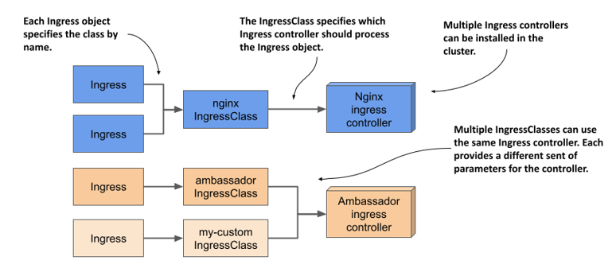

# 12.5 Using multiple ingress controllers
Since different ingress implementations provide different additional functionality, you may want to install multiple ingress controllers in a cluster. In this case, each Ingress object needs to indicate which ingress controller should process it. Originally, this was accomplished by specifying the controller name in the `kubernetes.io/ingress.class` annotation of the Ingress object. This method is now deprecated, but some controllers still use it.

Instead of using the annotation, the correct way to specify the controller to use is through IngressClass objects. One or more IngressClass objects are usually created when you install an ingress controller.

When you create an Ingress object, you specify the ingress class by specifying the name of the IngressClass object in the Ingress object’s `spec` field. Each IngressClass specifies the name of the controller and optional parameters. Thus, the class you reference in your Ingress object determines which ingress proxy is provisioned and how it’s configured. As you can see in the next figure, different Ingress objects can reference different IngressClasses, which in turn reference different ingress controllers.

Figure 12.9 The relationship between Ingresses, IngressClasses, and Ingress controllers



## 12.5.1 Introducing the IngressClass object kind
If the Nginx ingress controller is running in your cluster, an IngressClass object named `nginx` was created when you installed the controller. If other ingress controllers are deployed in your cluster, you may also find other IngressClasses.

#### Finding IngressClasses in your cluster
To see which ingress classes your cluster offers, you can list them with `kubectl get`:

```shell
$ kubectl get ingressclasses
NAME    CONTROLLER             PARAMETERS   AGE
nginx   k8s.io/ingress-nginx   <none>       10h
```

The output of the command shows that a single IngressClass named `nginx` exists in the cluster. Ingresses that use this class are processed by the `k8s.io/ingress-nginx` controller. You can also see that this class doesn’t specify any controller parameters.

#### Inspecting the YAML manifest of an IngressClass object
Let’s take a closer look at the `nginx` IngressClass object by examining its YAML definition:

```shell
$ kubectl get ingressclasses nginx -o yaml
apiVersion: networking.k8s.io/v1
kind: IngressClass
metadata:
  name: nginx
spec:
  controller: k8s.io/ingress-nginx
```

As you can see, this IngressClass object specifies nothing more than the name of the controller. Later you’ll see how you can also add parameters for the controller to the object.

## 12.5.2 Specifying the IngressClass in the Ingress object
When you create an Ingress object, you can specify the class of the ingress using the `ingressClassName` field in the `spec` section of the Ingress object, as in the following listing.

Listing 12.12 Ingress object referencing a specific IngressClass

```yaml
apiVersion: networking.k8s.io/v1
kind: Ingress
metadata:
  name: kiada
spec:
  ingressClassName: nginx
  rules:
  ...
```

The Ingress object in the listing indicates that its class should be `nginx`. Since this IngressClass specifies `k8s.io/ingress-nginx` as the controller, the Ingress from this listing is processed by the Nginx ingress controller.

#### Setting the default IngressClass
If multiple ingress controllers are installed in the cluster, there should be multiple IngressClass objects. If an Ingress object doesn’t specify the class, Kubernetes applies the default IngressClass, marked as such by setting the `ingressclass.kubernetes.io/is-default-class` annotation to `"true"`.

## 12.5.3 Adding parameters to an IngressClass
In addition to using IngressClasses to specify which ingress controller to use for a particular Ingress object, IngressClasses can also be used with a single ingress controller if it can provide different ingress flavors. This is achieved by specifying different parameters in each IngressClass.

#### Specifying parameters in the IngressClass object
The IngressClass object doesn’t provide any fields for you to set the parameters within the object itself, as each ingress controller has its own specifics and would require a different set of fields. Instead, the custom configuration of an IngressClass is typically stored in a separate custom Kubernetes object type that’s specific to each ingress controller implementation. You create an instance of this custom object type and reference it in the IngressClass object.

For example, AWS provides an object with kind `IngressClassParams` in API group `elbv2.k8s.aws`, version `v1beta1`. To configure the parameters in an IngressClass object, you reference the IngressClassParams object instance as shown in the following listing.

Listing 12.13 Referring to a custom parameters object in the IngressClass

```yaml
apiVersion: networking.k8s.io/v1
kind: IngressClass
metadata:
  name: custom-ingress-class
spec:
  controller: ingress.k8s.aws/alb
  parameters:
    apiGroup: elbv2.k8s.aws
    kind: IngressClassParams
    name: custom-ingress-params
```

In the listing, the IngressClassParams object instance that contains the parameters for this IngressClass is named `custom-ingress-params`. The object `kind` and `apiGroup` are also specified.

#### Example of a custom API object type used to hold parameters for the IngressClass
The following listing shows an example of an IngressClassParams object.

Listing 12.14 Example IngressClassParams object manifest

```yaml
apiVersion: elbv2.k8s.aws/v1beta1
kind: IngressClassParams
metadata:
  name: custom-ingress-params
spec:
  scheme: internal
  ipAddressType: dualstack
  tags:
  - key: org
    value: my-org
```

With the IngressClass and IngressClassParams objects in place, cluster users can create Ingress objects with the `ingressClassName` set to `custom-ingress-class`. The objects are processed by the `ingress.k8s.aws/alb` controller (the AWS Load Balancer controller). The controller reads the parameters from the IngressClassParams object and uses them to configure the load balancer.

Kubernetes doesn’t care about the contents of the IngressClassParams object. They’re only used by the ingress controller. Since each implementation uses its own object type, you should refer to the controller’s documentation or use `kubectl explain` to learn more about each type.