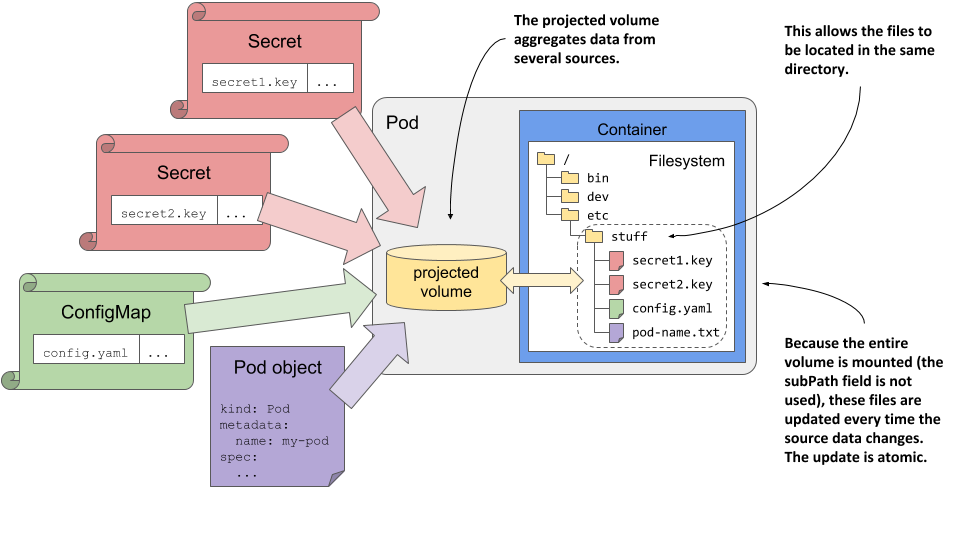

# 9.5 Using projected volumes to combine volumes into one
In this chapter, you learned how to use three special volume types to inject values from config maps, secrets, and the Pod object itself. Unless you use the subPath field in your volumeMount definition, you can't inject the files from these different sources, or even multiple sources of the same type, into the same file directory. For example, you can't combine the keys from different secrets into a single volume and mount them into a single file directory. While the subPath field allows you to inject individual files from multiple volumes, it isn’t the final solution because it prevents the files from being updated when the source values change.

If you need to populate a single volume from multiple sources, you can use the projected volume type.

## 9.5.1 Introducing the projected volume type
Projected volumes allow you to combine information from multiple config maps, secrets, and the Downward API into a single pod volume that you can then mount in the pod’s containers. They behave exactly like the configMap, secret, and downwardAPI volumes you learned about in the previous sections of this chapter. They provide the same features and are configured in almost the same way as the other volume types.

The following figure shows a visualization of a projected volume.

Figure 9.8 Using a projected volume with several sources



In addition to the three volume types described earlier, you can also use projected volumes to expose the service account token to your application. You’ll learn what those are in chapter 23.

## 9.5.2 Using a projected volume in a pod
In the final exercise of this chapter, you’ll modify the kiada-ssl pod to use a single projected volume in the envoy container. The previous version of the pod used a configMap volume mounted in /etc/envoy to inject the envoy.yaml config file and a secret volume mounted in /etc/certs to inject the TLS certificate and key files. You’ll now replace these two volumes with a single projected volume. This will allow you to keep all three files in the same directory (/etc/envoy).

First, you need to change the TLS certificate paths in the envoy.yaml configuration file inside the kiada-envoy-config config map so that the certificate and key are read from the same directory. After editing, the lines in the config map should look like this:

```
tls_certificates:
                - certificate_chain:
                    filename: "/etc/envoy/example-com.crt"
                  private_key:
                    filename: "/etc/envoy/example-com.key"
```

You can find the pod manifest with the projected volume in the file pod.kiada-ssl.projected-volume.yaml. The relevant parts are shown in the next listing.

Listing 9.22 Using a projected volume instead of a configMap and secret volume

```
apiVersion: v1
kind: Pod
metadata:
  name: kiada-ssl
spec:
  volumes:
  - name: etc-envoy
    projected:
      sources:
      - configMap:
          name: kiada-envoy-config   B
      - secret:
          name: kiada-tls
          items:
          - key: tls.crt
            path: example-com.crt
          - key: tls.key
            path: example-com.key
            mode: 0600
  containers:
  - name: kiada
    image: luksa/kiada:1.2
    env:
    ...
  - name: envoy
    image: envoyproxy/envoy:v1.14.1
    volumeMounts:
    - name: etc-envoy
      mountPath: /etc/envoy
      readOnly: true
    ports:
    ...
```

The listing shows that a single projected volume named etc-envoy is defined in the pod. Two sources are used for this volume. The first is the kiada-envoy-config config map. All entries in this config map become files in the projected volume. The second source is the kiada-tls secret. Two of its entries become files in the projected volume - the value of the tls.crt key becomes file example-com.crt, whereas the value of the tls.key key becomes file example-com.key in the volume. The volume is mounted in read-only mode in the envoy container at /etc/envoy.

As you can see, the source definitions in the projected volume are not much different from the configMap and secret volumes you created in the previous sections. Therefore, further explanation of the projected volumes is unnecessary. Everything you learned about the other volumes also applies to this new volume type.